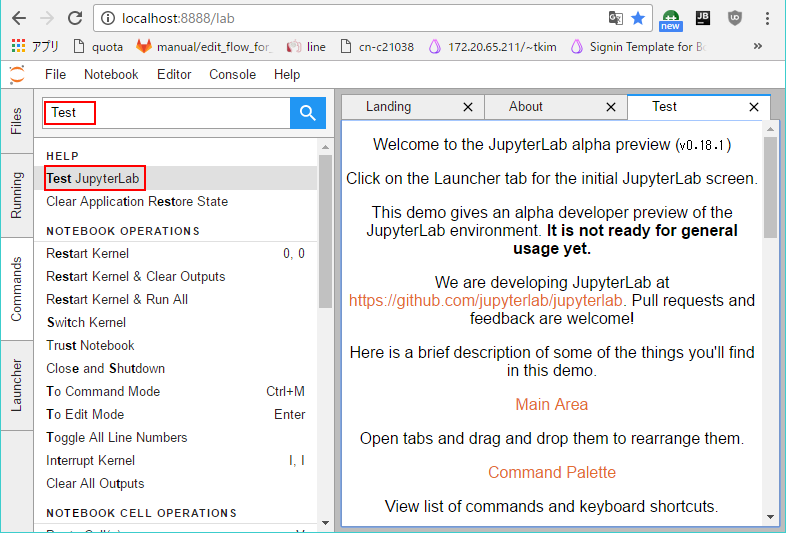

**[Prerequisites](#prerequisites)** |
**[Installation](#installation)** |
**[Contributing](#contributing)** |
**[License](#license)** |
**[Getting help](#getting-help)** |
**[한국어](https://github.com/crowdy/carme/blob/master/README.kr.md)**


# Carme, a [JupyterLab](http://jupyterlab.github.io/jupyterlab/) extension

[](https://greenkeeper.io/)
<!--
[](https://travis-ci.org/jupyterlab/jupyterlab)
[](http://mybinder.org/repo/jupyterlab/jupyterlab/lab)
[](https://jupyterlab-tutorial.readthedocs.io/en/latest/?badge=latest)
[](https://groups.google.com/forum/#!forum/jupyter)
-->

An extensible computational environment for Jupyter.

**JupyterLab is a very early developer preview, and is not suitable for
general usage yet. Features and implementation are subject to change. **

With JupyterLab, you can create a computational environment for Jupyter that
meets your workflow needs. Here's a quick preview of JupyterLab (link to 
YouTube):

[](https://www.youtube.com/watch?v=sf8PuLcijuA)

We have a [roadmap](https://github.com/jupyter/roadmap/blob/master/jupyterlab.md) of planned development.

----

## Prerequisites

Jupyter notebook version 4.2 or later. To check the notebook version:

```bash
jupyter notebook --version
```

### Supported Runtimes

The runtime versions which are currently *known to work*:

- Firefox 49+
- Chrome 39+
- Safari 10+

Earlier browser versions may also work, but come with no guarantees.

JupyterLab uses CSS Variables for styling, which is one reason for the
minimum versions listed above.  IE 11+ or Edge 14 do not support
CSS Variables, and are not directly supported at this time.
A tool like [postcss](http://postcss.org/) can be used to convert the CSS files in the
`jupyterlab/build` directory manually if desired.

----

## Installation

To clone carme

```bash
mkdir carme
git clone https://github.com/crowdy/carme.git
cd carme
```

```bash
# to get node modules
npm install

# to clone jupyterlab and append carme extensions and build them
npm run build:carme
```

Start up JupyterLab:

```bash
npm run run:carme
```

after modifying carme extenstions
```bash
npm run update:carme
```


JupyterLab will open automatically in your browser. You may also access
JupyterLab by entering the notebook server's URL (`http://localhost:8888`) in
the browser.

Instructions on how to install the project from the git sources are available in our [contributor documentation](CONTRIBUTING.md).

----

## 코드 수정하기
package를 추가하기 위해서는 다음과 같은 과정을 거칩니다. 예를 들어 test-extionsion을 작성한다고 합니다. about-extension을 수정해 /carme_extension/packages/test-extension을 작성해 두었습니다.

- node_modules가 .gitignore되어 있으므로 없다면 ``npm install``로 필요한 모듈들을 설치해 둡니다. 그래야 vscode로 보았을 때, 경고를 내지 않습니다.
- ``carme_extension/packages/package.json`` 파일을 작성합니다. 필요한 모듈이 있다면 추가해 줍니다.
- tsc 용 ``carme_extension/packages/tsconfig.json`` 파일을 작성합니다. TypeScript의 컴파일 옵션은 대게 동일하므로 그대로 복사하면 됩니다.
- index.ts에는 command palette에 ``Test JupyterLab``의 라벨을 등록하는 코드가 있습니다.
```typescript
  commands.addCommand(command, {
    label: 'Test JupyterLab',
    execute: () => {
      if (!widget || widget.isDisposed) {
        widget = newWidget();
        shell.addToMainArea(widget);
      }
      tracker.activate(widget);
    }
  });
```

carme/carme_extension/jupyterlab/src/main.ts 파일을 수정해, 추가하고자 하는 package를 추가합니다.
추가하는 방법은 import하기, JupyterLab.IPluginModule 안에 넣어주기를 통해서 합니다.

``npm run update:carme``
carme_extension 의 내용을 carme에 덮어 쓰고 build합니다.

``npm run run:carme``
carme의 내용을 실행합니다.

Commands의 내용을 안에서 Test 라는 키를 넣어보면 Test JupyterLab이라고 하는 항목이 추가된 것을 확인할 수 있습니다.



## Contributing

If you would like to contribute to the project, please read our [contributor documentation](CONTRIBUTING.md).

----

## License
We use a shared copyright model that enables all contributors to maintain the
copyright on their contributions.

All code is licensed under the terms of the revised BSD license.

----

## Getting help
We encourage you to ask questions on the [mailing list](https://groups.google.com/forum/#!forum/jupyter),
and you may participate in development discussions or get live help on [Gitter](https://gitter.im/jupyterlab/jupyterlab).


## Resources

- [Reporting Issues](https://github.com/crowdy/carme/issues)
- [Architecture tutorial for Project Jupyter](https://jupyterlab-tutorial.readthedocs.io/en/latest/index.html)
- [Documentation for Project Jupyter](https://jupyter.readthedocs.io/en/latest/index.html) | [PDF](https://media.readthedocs.org/pdf/jupyter/latest/jupyter.pdf)
- [Project Jupyter website](https://jupyter.org)
